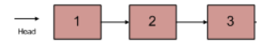

---
title: 算法题_反转链表
tags: 新建,模板,小书匠

从尾到头打印链表。
描述：
输入一个链表的头节点，按链表从尾到头的顺序返回每个节点的值（用数组返回）。

如输入{1,2,3}的链表如下图:

返回一个数组为[3,2,1]

0 <= 链表长度 <= 10000
``` 
import java.util.ArrayList;
public class Solution {
    ArrayList<Integer> list = new ArrayList();
    public ArrayList<Integer> printListFromTailToHead(ListNode listNode) {
        if(listNode!=null){
            printListFromTailToHead(listNode.next);
            list.add(listNode.val);
        }
        return list;
    }
}
```


